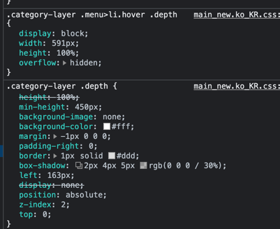
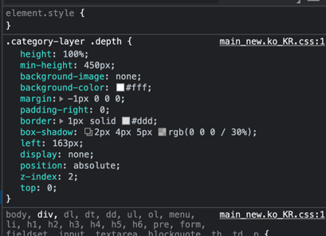
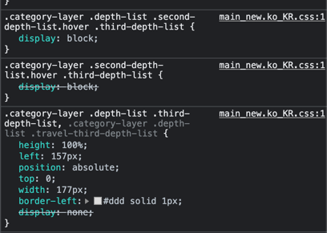
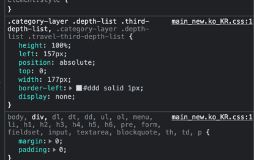

# fe-shopping

- [x] 검색창 관련 모듈 개발
- [x] 프로토타입 / 클래스 혼용
- [X] SCSS 및 마크업
- [X] 자동 캐러셀 이벤트
- [] 카테고리 드롭다운 애니메이션
- [] 검색창 방향키 탐색기능

## 설계 변경 사항

기존의 노드와 연결리스트를 이용한 렌더링에서, 전역 객체를 활용하기 위해 Proxy 트랩을 만들고 setter 실행마다 키값으로 해당 키값에 구독한 컴포넌트들을 렌더링하는 방법을 사용했습니다. 구독은 컴포넌트가
직접 initState에 명시한 객체 키 밸류에 의해 이뤄지며 unsubscribe 기능도 추가하기는 했지만 사용은 하지 않았습니다.
컬렉션을 사용하지 않고 뭔가 데코레이터 패턴 같은 연결리스트를 사용하면 자기 자신의 렌더링 결정 로직을 스스로 정할 수 있게 되어 복잡한 렌더링이 가능하지 않을까 해서 지난번 피드백 주신 children의 Set으로
관리하는 방식보다는 연결 리스트를 사용하는 방식으로 진행하려고 생각했습니다.
변명이지만 지난 일주일 컨디션이 안좋아서 미션이 집중하기 힘들었어서 진행이 많이 느립니다 ㅜㅜ 다음 주 기한이 일주일 더 주어지니 최대한 제가 목표로 하는 것들을 구현해서 완성해볼 수 있게끔 하겠습니다.

